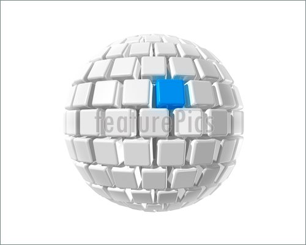

# Game Engines Assignment
## Concept
My current idea for the project is to create an audio visualizer in unity that will manipulate a sphere made of cubes. The main way it will do this is by getting data from the audio source using the AudioSource.GetSpectrumData function in unity. The shape, size and colour of the cubes will be changed based on the volume and frequency of the audio source. 

## References
- Unity API on Spectrum Data https://docs.unity3d.com/ScriptReference/AudioSource.GetSpectrumData.html
- Research on fast fourier transforms (FFTs) and windowing
http://www.ni.com/white-paper/4844/en/  
- Visualizer inspiration
http://www.ni.com/white-paper/4844/en/
